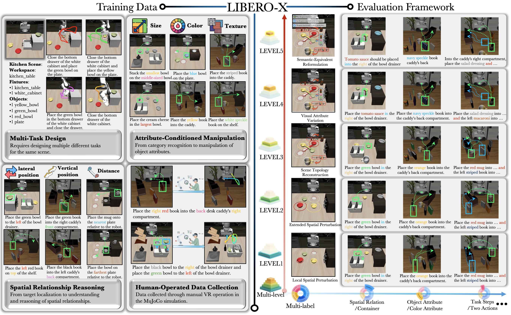
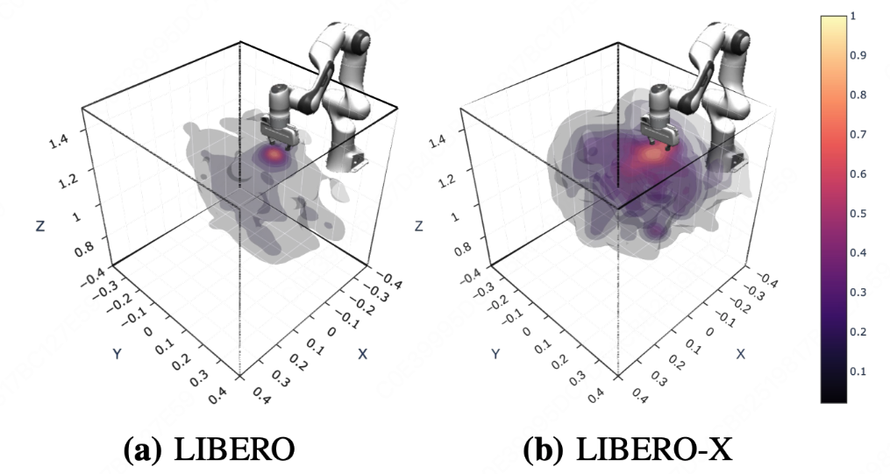
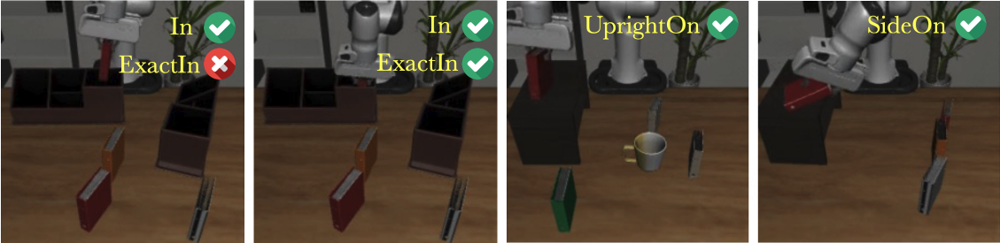

<div align="center">

## **LIBERO-X Robustness Litmus for Vision-Language-Action Models**

Guodong Wang*, Chenkai Zhang*, Qingjie Liu, Jinjin Zhang, Jiancheng Cai, Junjie Liu<sup>†</sup>, Xinmin Liu<sup>‡</sup>

<small style="color: gray; font-size: 0.8em; display: block;">
  <sup>*</sup>Equal Contribution <sup>†</sup>Corresponding Author <sup>‡</sup>Project Leader
</small>

[[Website]](https://meituan.github.io/LIBERO-X/) [[Paper]](https://arxiv.org/pdf/2602.06556) [[Hugging Face]](https://huggingface.co/datasets/meituan/LIBERO-X)
______________________________________________________________________

</div>

**LIBERO-X** is a comprehensive benchmark designed for robotic manipulation, featuring a progressively challenging evaluation framework. It systematically characterizes model performance under multi-dimensional distribution shifts by jointly perturbing spatial layouts, object properties, and instruction semantics. Key features of LIBERO-X include:
- **Multi-level evaluation framework**: Comprising 5 distinct difficulty levels, each annotated with multi-labels for spatial, visual, and semantic attributes to enable fine-grained analysis.
- **High-diversity training dataset**: Collected via human teleoperation, it includes 2,520 demonstrations, 600 tasks, and 100 scenes, ensuring broad generalization across diverse scenarios.


##  TODO
- [x] Release multi-level & multi-label evaluation scenes and tasks
- [ ] Release fine-tuned VLA models
- [ ] Release LIBERO-X training data

______________________________________________________________________

## Installation
```
conda create -n liberox python=3.9
conda activate liberox
git clone https://github.com/meituan/LIBERO-X
cd LIBERO-X
pip install -r requirements.txt
```

Then install the `libero-x` package:
```
pip install -e .
```

## Training Data (coming soon)

LIBERO-X introduces finer-grained task-level extensions to expose models to diverse task formulations and workspace configurations, featuring: 
- Multi-Task Scene Design
- Attribute-Conditioned Manipulation
- Spatial Relationship Reasoning
- Human Demonstration Collection

LIBERO-X exhibits a broader spread and higher trajectory density, demonstrating its greater diversity.



## Evaluation

To enable more fine-grained evaluation of VLA models, we improve the original [LIBERO](https://github.com/Lifelong-Robot-Learning/LIBERO) by introducing new objects with diverse shapes and textures, along with additional predicates (including `ExactIn`, `UprightOn` and `SideOn` to enrich the goal states.




`eval_template.py` implements a client-server mode for VLA model evaluation and rollout video recording. 

```bash
python eval_template.py \
  --scene-group LEVEL1 \               # LEVEL1–LEVEL5
  --load-mode init \                   # bddl or init
  --bddl-root libero/libero_x/bddl \   # BDDL root (default libero/libero_x/bddl)
  --init-root libero/libero_x/init \   # init root (default libero/libero_x/init)
  --video-out-path data/eval_videos \  # output directory for videos and results
  --num-trials-per-task 10 \           # trials per task
  --host 127.0.0.1 \
  --port 8000
```

## Acknowledgements
We sincerely thank the authors of [LIBERO](https://github.com/Lifelong-Robot-Learning/LIBERO) and [openpi](https://github.com/Physical-Intelligence/openpi) for their valuable open-source contributions to the research community. Their well-designed frameworks have not only enabled our work but also significantly benefited the broader robotics field by providing accessible, high-quality tools for reproducible research.

## Citation
If you find **LIBERO-X** to be useful in your own research, please consider citing our paper:

```bibtex
@article{wang2026libero,
  title={LIBERO-X: Robustness Litmus for Vision-Language-Action Models},
  author={Wang, Guodong and Zhang, Chenkai and Liu, Qingjie and Zhang, Jinjin and Cai, Jiancheng and Liu, Junjie and Liu, Xinmin},
  journal={arXiv preprint arXiv:2602.06556},
  year={2026}
}
```

## License
| Component        | License                                                                                                                             |
|------------------|-------------------------------------------------------------------------------------------------------------------------------------|
| Codebase         | [MIT License](LICENSE)                                                                                                              |
| Datasets         | [Creative Commons Attribution 4.0 International (CC BY 4.0)](https://creativecommons.org/licenses/by/4.0/legalcode)                 |